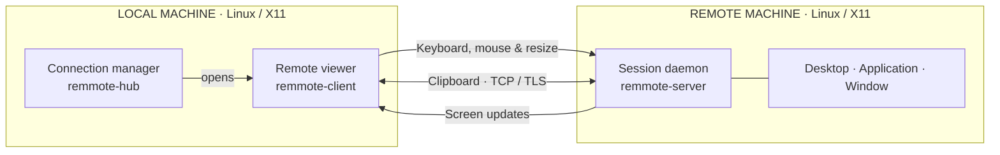
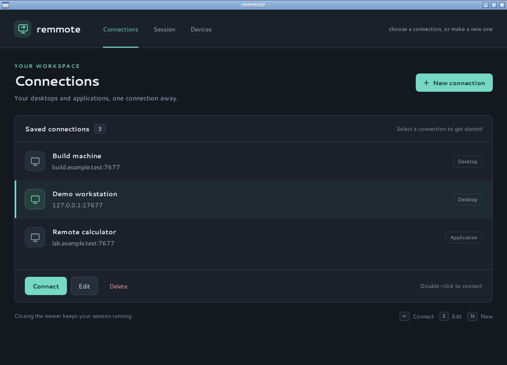
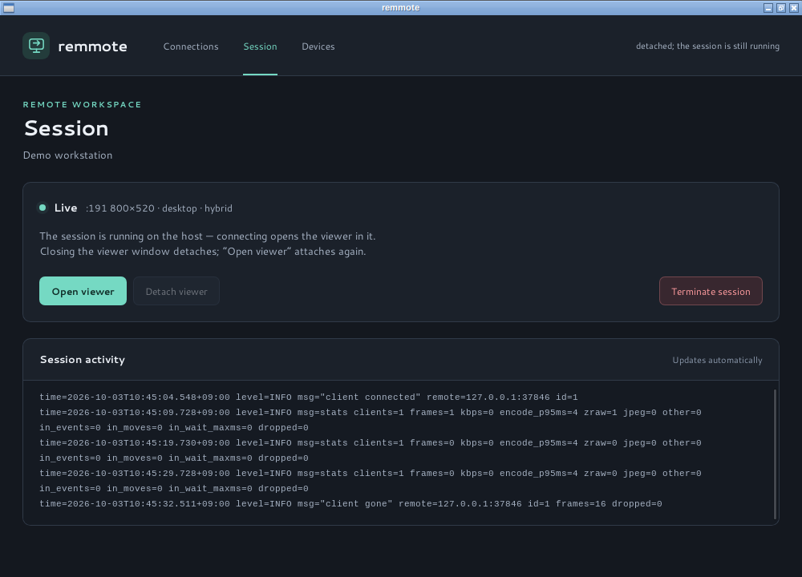
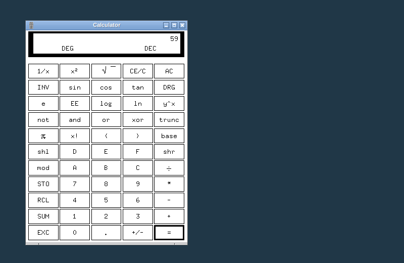

# remmote

**Remote desktops and applications, from Linux to Linux.**

remmote is a direct, point-to-point remote access application for **Linux X11
on both ends**. View and control a desktop, launch a remote application, or
share an existing window—with keyboard, mouse, clipboard sync, and sessions
you can leave running and reconnect to later.

The server, viewer, and command-line tools are written in Go and build without
CGo. An optional native connection manager helps you save connections and
manage sessions and paired devices. No cloud account or relay service is required.

[Quick start](#quick-start) · [Screenshots](#screenshots) · [Build](#build) ·
[Usage](#usage) · [Troubleshooting](#troubleshooting) · [Development](#development)

## Linux to Linux



> [!IMPORTANT]
> **Linux → Linux only.** Both the host and the viewer require X11.
> Native Wayland sessions, Windows, macOS, and mobile clients are not supported.
> A headless host can use Xvfb; a nested session can use Xephyr.

## Features

| Capability | What you can do |
|---|---|
| **Desktop and application sharing** | Share a full desktop, launch one application (`-exec`), or attach to an existing window (`-window`). |
| **Full remote control** | Use your keyboard and mouse, with bidirectional UTF-8 clipboard sync. |
| **Efficient streaming** | Capture changed regions with XDamage and MIT-SHM; use lossless zstd for compressible content and JPEG for other regions. Optional WebP encoding is available. |
| **Responsive sizing** | Resize the shared application from the viewer, or enable `-resize-desktop` to resize the host desktop through RANDR. |
| **Persistent sessions** | Close the viewer to detach; reconnect later to the same session. Terminate sessions explicitly from the hub or CLI. |
| **Disposable displays** | Create an isolated Xvfb or Xephyr display for a session and remove it when the session ends. |
| **Connection manager** | Save connection profiles, configure sessions, and manage paired devices with `remmote-hub`. |
| **Encryption and access control** | Use TLS with a shared secret or certificate pinning, or pair devices with individual credentials, roles, and revocation. |
| **Automation** | Control sessions with `remmote-ctl`, a JSON HTTP API, and server-sent events. |

## Screenshots

These are captures of the actual application using disposable Xvfb displays
and dummy connection profiles. **Demo workstation** connects to a real local
server at `127.0.0.1:17677`; the other saved hosts are illustrative placeholders.

**Connection manager** — saved desktops and applications in one place.

[](docs/screenshots/connections.png)

| Session management | Connected demo desktop |
|---|---|
| [](docs/screenshots/session.png) | [](docs/screenshots/demo-connection.png) |
| Inspect session state, reopen the viewer, or terminate the session. | A real loopback connection to an isolated Linux desktop running `xcalc`. |

Click any screenshot to view it at full size. See the
[capture notes](docs/screenshots/README.md) for the demo setup.

## Quick start

Build the tools with Go 1.22 or later:

```sh
make build
```

On the **remote Linux host**, run this from a terminal in the X11 session you
want to share. Replace the example secret with your own:

```sh
./bin/remmote-server -display "$DISPLAY" -listen :7677 -tls 'replace-with-your-shared-secret'
```

On the **local Linux viewer**, use the same secret and replace the example
address with your host's address:

```sh
./bin/remmote-client -server 192.168.1.10:7677 -tls 'replace-with-your-shared-secret'
```

Both machines need network access to the server's listening port. Close the
viewer to detach; the host session stays running. For a graphical connection
manager, [build the hub](#build) and run `./bin/remmote-hub`. For a guided
terminal setup, run `./scripts/remmote.sh`.

> [!WARNING]
> An unencrypted, unauthenticated connection gives anyone who can reach the
> listener access to the shared desktop. Use a shared secret or
> [paired devices](#authentication-paired-devices) to restrict access.
> TLS encryption alone does not authenticate clients. Non-loopback listeners
> require TLS unless explicitly started with `-insecure`.

For an SSH tunnel, bind the server to loopback on the host and connect through
it from the viewer:

```sh
# On the host, inside the X11 session
./bin/remmote-server -display "$DISPLAY" -listen 127.0.0.1:7677

# On the viewer, keep this tunnel running in a separate terminal
ssh -N -L 17677:127.0.0.1:7677 user@host

# On the viewer, connect through the tunnel
./bin/remmote-client -server 127.0.0.1:17677
```

## Why remmote?

remmote focuses on remote work between Linux machines on networks you control.
It brings desktop sharing, individual application sharing, persistent sessions,
and disposable displays into a direct client/server workflow.

The scope is deliberately focused: Linux X11, direct connections, and remote
keyboard and mouse control. Audio, file transfer, relay infrastructure, and
cross-platform clients are outside the current feature set.

## Build

Requires **Go 1.22 or later**. The server and viewer run on Linux with X11;
the default binaries do not need CGo or a GUI toolkit to build:

```sh
make build          # → bin/remmote-server, bin/remmote-ctl, bin/remmote-client
```

The connection manager is the one program with a window toolkit: it is a
Wails app (HTML/CSS in a native webview), so it needs CGo and the
webkit2gtk headers, and it builds separately:

```sh
sudo apt install libgtk-3-dev libwebkit2gtk-4.1-dev   # Debian/Ubuntu
make build-hub    # → bin/remmote-hub (skipped politely when those are missing)
```

Everything else keeps building without them. The Makefile puts every
standard `pkgconfig` directory in front of `pkg-config`, because on some
multiarch systems the `pkg-config` binary is built for another
architecture and never looks in `/usr/lib/<triplet>/pkgconfig` — which
hides perfectly installed libraries from both the check and cgo.

### Codecs

| `-codec` | Encoder | Wire byte | Needs |
|---|---|---|---|
| `hybrid` (default) | ZRAW when the rect compresses ≥4:1, else JPEG | 3 / 1 | — |
| `zraw` | zstd on raw pixels (lossless, always ZRAW) | 3 | — |
| `jpeg` | stdlib JPEG | 1 | — |
| `webp` | libwebp, ~25–35% smaller than JPEG | 2 | `-tags webp` build |

ZRAW is [klauspost/compress](https://github.com/klauspost/compress) zstd
at `SpeedFastest` over the raw frame bytes — pure Go, no build tag, and
because desktop content (flat colors, text) is highly redundant it lands
one to two orders of magnitude below JPEG in both time and bytes. The
hybrid gate (≥4:1) bounds bandwidth to 25% of raw and falls back to JPEG
for content zstd handles poorly (photos, gradients, noise). The picker
runs per rect, so a mixed screen always gets the cheap option; hybrid
never appears on the wire.

The client decodes every codec regardless of how it was built. A server
built without the WebP tag refuses `-codec webp` at startup — never
mid-stream.

### Optional: lossy WebP codec

WebP encodes ~25–35% smaller than JPEG at similar quality. The encoder is
libwebp (C), so it is kept out of the default build behind a build tag:

```sh
sudo apt install libwebp-dev     # Ubuntu/Debian
make build-webp                  # → same binaries + WebP, run server with -codec webp
```

## Usage

Rather answer questions than assemble flags? `./scripts/remmote.sh`
asks what to run (server or client), on which display, and with which
options — including `-exec`, `-window`, `-maximize`, `-resize-desktop`
and the three `-tls` modes — then prints the exact command line and runs
it (`--print` to only print it). On the server side it also prints, in a
box, the `remmote-client` command that connects to it — with the right
address (this machine's, over a tunnel when the server listens on
localhost only) and the matching `-tls`, `-upscale` and clipboard flags.
Name a display that does not exist yet and it offers to create one for
you, running `scripts/start-xvfb.sh` or `scripts/start-xephyr.sh` and
picking up the cookie they make — and a display it started is stopped
again when the run ends, Ctrl-C included (only `--print` or "run it
now? n" keep it, since the printed command still needs it). The manual
form follows.

For the examples below, set `REMMOTE_SECRET` to the same non-empty shared
secret in both terminals. Replace `:0` with the host X11 display if needed.

Share the whole desktop — on the **host**:

```sh
./bin/remmote-server -display :0 -listen :7677 -tls "$REMMOTE_SECRET"
```

Share a single application instead (spawned by the server, killed with it):

```sh
./bin/remmote-server -display :0 -listen :7677 -tls "$REMMOTE_SECRET" -exec xcalc
```

Share an existing window (find ids with `xwininfo`):

```sh
./bin/remmote-server -display :0 -listen :7677 -tls "$REMMOTE_SECRET" -window 0x2c00005
```

On the **viewer**:

```sh
./bin/remmote-client -server 192.168.1.10:7677 -tls "$REMMOTE_SECRET"
```

That's it — move the mouse over the window and type. Close the viewer
window to disconnect (the client also auto-reconnects if the network
drops).

Or let the client ask: **`./bin/remmote-hub` opens the connection
manager** — a window with the connections you have saved, a form for
what to share, a panel for whatever is running right now, and the list
of paired devices. `Enter` connects; `e` edits; `n` makes a new one.
Connecting puts you back in what the host is sharing — the viewer opens
in a session that is already running, and a host with nothing to join
gets a new one, whose viewer opens as soon as it is live. Closing the
viewer's window detaches and nothing
more — the session goes on, and connecting again picks it up.
Terminating a session is a deliberate act on the panel: the session
ends, and the daemon stays up for the next one. Connections
are saved in `~/.config/remmote/profiles.d/` (one JSON file each,
hand-editable). (`remmote-client` with no `-server` launches the manager
for you when it is installed.)

### The daemon and its session

`remmote-server` is a daemon, and the session lives in it — not in the
viewer. Closing the viewer window *detaches*: the display, the
application and the capture keep running, and a viewer can attach again
at any time (that is the point of leaving it running). Ending the
session is deliberate: `remmote-ctl terminate` stops the session — the
display, the application, the capture — and the daemon stays up, ready
for the next one.

The flags above describe the session shared **at startup**. A client can
also say what to share, at any time, over the control API — `remmote-ctl
start -spec spec.json` or the connection manager — and with `-idle`
the daemon shares nothing until one does. Only one session runs per
daemon.

Launching an application on request (`source: "app"`) is refused by
default: the daemon will share displays and windows that already exist,
but running a program on the host is the operator's decision — start it
with `-allow-exec xcalc,xterm` to permit those commands, or keep the
list in a text file (one command per line, `#` comments) and point
`-allow-exec-file /etc/remmote/allowed-apps.txt` at it. Matching is by
command basename; `*` permits everything.

```sh
# a daemon that waits for a client to say what to share
./bin/remmote-server -idle -listen :7677 -tls "$REMMOTE_SECRET" -allow-exec xcalc

# ... and a client that starts a session on it
./bin/remmote-ctl -server 192.168.1.10:7677 -tls "$REMMOTE_SECRET" start -spec session.json -wait
```

`remmote-ctl` speaks the same API as the connection manager: `host` (what the daemon
offers), `session`, `start`, `events`, `terminate`. The spec is JSON —
the same shape as a saved connection profile:

```json
{
  "source": "desktop",
  "display": {"kind": "existing", "name": ":0"},
  "stream": {"codec": "hybrid", "quality": 75, "resizeDesktop": true}
}
```

`source` is `desktop`, `app` (with `app.command`) or `window` (with
`window.id`). `display.kind` is `existing` (share a display that is
already there) or `create` — the daemon then makes the display for the
session and destroys it, its window manager and its cookie again when
the session ends:

```json
{
  "source": "desktop",
  "display": {"kind": "create", "create": {"server": "xvfb", "size": "800x600", "wm": "openbox"}},
  "stream": {"codec": "hybrid"}
}
```

`create.server` is `xvfb` (headless) or `xephyr` (nested in another
session, which needs `create.hostDisplay`); `create.wm` is one of the
window managers `GET /api/v1/host` reports, or `"none"`. The display
gets its own magic cookie, so it is not open to anyone else on the
machine — and the viewer's stream is what proves the cookie works.

### Your own display (headless or nested)

`-display` takes any X display, including one you start yourself — no
existing desktop session is required. Two scripts do the asking and the
starting; they explain their limitations first, detect (or offer to
install) what is missing, and let you pick the display number and an
optional window manager for inside it:

```sh
./scripts/start-xvfb.sh     # headless screen :88 (Xvfb) — nothing visible locally
./scripts/start-xephyr.sh   # nested screen :88 in a window on your own desktop (Xephyr)
```

Both protect the new display with a magic cookie (xauth) and print the
exact remmote-server command line to run against it. Underneath it is
ordinary X:

```sh
Xvfb :88 -screen 0 1920x1080x24 &        # apt install xvfb
XAUTHORITY=~/.Xauthority ./bin/remmote-server -display :88 -listen :7677 -tls "$REMMOTE_SECRET" -exec xcalc

# or let xvfb-run make the display and just use its $DISPLAY:
xvfb-run -a ./bin/remmote-server -listen :7677 -tls "$REMMOTE_SECRET" -exec xcalc
```

Worth knowing about a display you create:

- **There is no window manager** unless you start one, so windows are
  neither decorated nor placed — remmote handles bare displays (that is
  exactly how its integration tests run), but `DISPLAY=:88 openbox &`
  gives the application normal decorations if you want them. Both
  scripts can start one for you (whatever is installed: openbox,
  fluxbox, marco, mutter, …).
- **An Xvfb screen is fixed when it is created.** Xvfb offers RANDR
  exactly one mode — its `-screen` size — so it can never be resized
  afterwards: with `-resize-desktop` the server logs the refusal and the
  viewer letterboxes as usual. Xephyr's nested screen follows its
  window instead (resize the window on the host desktop) and accepts
  `-resize-desktop` through its RandR (imperfectly: its mode list is
  fixed and even gets emptied on a window resize, which remmote works
  around), while a real Xorg session with outputs resizes normally.
  *Window* mode (`-exec`/`-window`) resizes the application itself and
  works on any display.
- **An unprotected display is shared with every local user.** The
  scripts generate a magic cookie unless you pass `--no-auth`; do that
  only where you trust everyone with an account.

### Window mode (`-exec` / `-window`)

The viewer then sees a mini-desktop that is exactly the application: the
canvas is the bounding box of the application's windows at their on-screen
positions. Windows join the set when they are transient for a tracked
window (dialogs, menus), carry the app's `_NET_WM_PID`, or share its
`WM_CLASS`. Menus drawn inside a window are captured automatically. The
canvas resizes (with a keyframe) when windows move, resize, appear, or
close. Input: moving over the viewer moves the host pointer; clicks and
keystrokes raise and focus the target window first so they cannot land on
something stacked above; clicks in the gaps between windows are ignored.

`-maximize` puts the main window onto the whole host screen before sharing
it, so the canvas fills the screen instead of the window's natural size.
The request goes through the window manager (EWMH) where one runs and is a
plain resize otherwise, and it is applied once, when the window becomes
viewable — so it also works for an application whose window appears late,
or a single-instance one that hands off to an already-running process.
Dialogs keep their natural size.

**Resizing the viewer window resizes the application** — the viewer ends
up a 1:1 view of it, no letterbox. The size travels as a `Resize` message
(debounced, so a drag sends only the size you settle on), and the server
applies it to the main window the same way `-maximize` does: EWMH
`_NET_MOVERESIZE_WINDOW` through the window manager — announced with only
the width/height bits so the window does not move — or a plain
`ConfigureWindow` on a bare display. The canvas then recomputes with a
keyframe, and because it is quantized to a 32 px grid the fill is exact
to within ±16 px. Dialogs keep their natural size, as with `-maximize`;
if an application refuses the size (terminal columns, size increments),
the viewer letterboxes what it gets.

When the application exits the **server stays up** and keeps serving the
last frame; restarting the share means restarting the command. Shutting
the server down kills the spawned process group.

Limitations: override-redirect popups that match none of the membership
rules are not captured; on non-compositing window managers, regions
obscured by unrelated windows may show stale pixels until the next
keyframe (2 s).

### remmote-server flags

| Flag | Default | Meaning |
|---|---|---|
| `-display` | `$DISPLAY` | X display to capture and control (the startup session) |
| `-listen` | `:7677` | TCP listen address — the control API and the streams share it |
| `-idle` | off | share nothing at startup; wait for a client to say what to share |
| `-allow-exec` | — | comma-separated commands clients may launch (`source: app`); empty refuses them all. A session started from these flags is never restricted |
| `-allow-exec-file` | — | text file of commands clients may launch, one per line (`#` comments, `*` for all); adds to `-allow-exec`. A file that cannot be read stops the daemon at startup |
| `-auth` | off | admit only **paired devices** — each named, roled and revocable — with its own TLS (the authority signs the daemon's certificate too) |
| `-auth-dir` | `~/.config/remmote/daemon` | with `-auth`: where the authority, its roster and the current pairing code live |
| `-insecure` | off | allow an unencrypted listener that is not loopback-only (never on a shared network) |
| `-fps` | `60` | max frames/s (also the damage merge window) |
| `-codec` | `hybrid` | `hybrid`, `zraw`, `jpeg` or `webp` (webp needs a `-tags webp` build) |
| `-downscale` | `1` | divide stream width/height by 2 or 4 to reduce encoded pixels 4× or 16×; mouse coordinates are mapped back automatically |
| `-quality` | `75` | encoder quality 1-100 (clients may override live; JPEG/WebP only) |
| `-refresh` | `2s` | periodic full-frame keyframe interval (skipped while nothing changes) |
| `-dump-frame` | — | capture one frame to a PNG and exit (diagnostics) |
| `-test-inject` | — | move the pointer and type `a`, then exit (diagnostics) |
| `-exec` | — | run this command and share only its windows (e.g. `-exec xcalc`) |
| `-window` | — | share this existing window id (hex) and windows it spawns |
| `-maximize` | off | with `-exec`/`-window`: maximize the shared window onto the host screen once it appears |
| `-resize-desktop` | off | whole-desktop mode: let a viewer's window resize the host screen (best effort via RANDR; ignored with `-exec`/`-window`, which resize the application instead) |
| `-tls` | off | encrypt the stream: no value to generate and print a certificate fingerprint, a shared secret both sides pass (it also makes the server admit only clients that have it), or `SHA256:…` to assert the `-tls-cert` certificate |
| `-tls-cert` | — | with `-tls`: PEM certificate to use (default: generate and cache one) |
| `-tls-key` | — | with `-tls`: PEM private key to use (default: generate and cache one) |
| `-no-clipboard` | off | disable clipboard synchronization |
| `-v` / `-log-json` | off | debug level / JSON logs |

### remmote-client flags

| Flag | Default | Meaning |
|---|---|---|
| `-display` | `$DISPLAY` | X display for the viewer window |
| `-server` | — | `host:port`; **omit it to open the connection manager** (saved connections, the options form, the session panel) |
| `-quality` | `0` | JPEG/WebP quality 1-100; 0 = keep default. ZRAW remains lossless |
| `-fast-scale` | off | use nearest-neighbor viewer scaling for lower CPU use, with rougher edges |
| `-upscale` | `1` | magnify the stream by 1, 2 or 4 back to host resolution; match the server's `-downscale` so the canvas, window and pointer mapping use host coordinates |
| `-tls` | off | encrypt the stream (the server must be started with `-tls`): no value to accept its certificate as it arrives, `SHA256:…` to pin it, or the shared secret the server was started with (the server requires a secret when it was started with one) |
| `-once` | off | exit after the first keyframe (no window; CI mode) |
| `-snapshot` | — | with `-once`: write the first full frame as a PNG |
| `-snapshot-after` | — | with `-snapshot`: run the live session for D, write the composited canvas (keyframe + deltas), exit (CI) |
| `-no-clipboard` | off | disable clipboard synchronization |
| `-v` / `-log-json` | off | as above |


### Responsiveness controls

For a LAN, start with hybrid compression and a 60 FPS cap:

```sh
./bin/remmote-server -codec hybrid -fps 60 -downscale 2
./bin/remmote-client -server HOST:7677 -fast-scale
```

`-downscale 2` sends half the width and height (one-quarter of the pixels).
`-downscale 4` sends one-sixteenth as many pixels but loses much more detail.
This reduces encoding, decoding, and bandwidth work; capture still reads the
original region. Keep `-downscale 1` for sharp text. Settings work with both
whole-desktop and application sharing, including pointer coordinate mapping.

### Restoring full resolution on the viewer

A downscaled stream leaves the viewer canvas, window and pointer mapping in
stream coordinates. Pass the matching `-upscale` to bring them back to host
resolution:

```sh
./bin/remmote-server -codec hybrid -fps 60 -downscale 2
./bin/remmote-client -server HOST:7677 -upscale 2
```

Each received pixel is replicated into a 2×2 block — the exact inverse of the
server's point sampling, so every pixel sits where the host drew it, and the
window opens at the host's size instead of half of it. Pointer coordinates are
divided on the way out and multiplied back by the server, so the click still
lands on the same host pixel as without `-upscale`. It costs client-side CPU
and memory (a full-resolution canvas) and recovers no detail the server threw
away; it fixes geometry, not sharpness. The two flags are independent — an
unmatched pair still connects, but the canvas and the pointer mapping will
disagree.

If bandwidth is the bottleneck, try:

```sh
./bin/remmote-server -codec jpeg -quality 40 -fps 30 -downscale 2
./bin/remmote-client -server HOST:7677 -quality 40 -fast-scale
```

Lower JPEG quality reduces bytes, but JPEG can use more CPU than hybrid/ZRAW
for desktop content. Quality does not affect lossless ZRAW frames. Client
quality requests affect the shared encoder for all connected viewers. Raising
FPS reduces capture waiting but increases CPU/network demand; lowering FPS
reduces that demand at the cost of slower visual feedback. A longer server
`-refresh` interval (for example `10s`) also reduces periodic full-screen work.
See [PERFORMANCE.md](PERFORMANCE.md) for measured tradeoffs and benchmark commands.


### Resizing the host desktop (`-resize-desktop`)

In whole-desktop mode, resizing the viewer window normally only changes
the letterbox. Start the server with `-resize-desktop` and the same drag
resizes the **host screen**: the server asks RANDR for the framebuffer
size the viewer's window asked for, clamped to what the display allows,
and — when the screen has to shrink — first moves each output to the
largest mode that fits before retrying.

```sh
./bin/remmote-server -display :0 -listen :7677 -tls "$REMMOTE_SECRET" -resize-desktop
```

- **Best effort, and it falls back quietly.** Displays vary wildly in
  what they accept: Xvfb exposes a single fixed mode (its screen can
  never be resized), a monitor may have no mode near the size you asked
  for, and a multi-head session may not be packable that small. When the
  server cannot do it, it logs one warning — the viewer keeps
  letterboxing, and the desktop is left exactly as it was (a mode change
  that is refused is rolled back).
- **This changes your real desktop.** Windows relayout, outputs are
  re-moded, and on a multi-monitor host both screens take part. That is
  why the flag exists: without it the server ignores the request with a
  single log line telling you how to enable it.
- The viewer needs no flag; every connected viewer can drive it, so the
  last resize wins.


`-tls` takes an optional value, and both sides read it the same way:

```sh
# simplest — encrypted, but the client does not check who it is talking to
./bin/remmote-server -tls
./bin/remmote-client -server HOST:7677 -tls

# verified — the same secret on both sides, nothing to copy out of a log
./bin/remmote-server -tls "$(openssl rand -hex 16)"
./bin/remmote-client -server HOST:7677 -tls "$(openssl rand -hex 16)"  # same value

# or pin the fingerprint the server prints when it starts
./bin/remmote-server -tls                     # logs … fingerprint=SHA256:48bc…
./bin/remmote-client -server HOST:7677 -tls SHA256:48bc…
```

**No value** — the server generates a certificate and caches it under
`~/.config/remmote/`, so the fingerprint survives restarts, and the client
encrypts while accepting the certificate as it arrives. That is not a
check, so the client says so:

```
TLS: encrypting without verifying the server certificate; pass the
server's -tls value (its fingerprint, or the shared secret) to have it checked
```

`-tls auto` is the same thing spelled out; `-tls off` is an explicit off.

**A shared secret** — the certificate is *derived* from the value (scrypt
into an ECDSA P-256 key, one scrypt call per side, ~60 ms), so both peers
reach the same fingerprint without exchanging anything. Nothing but the
certificate crosses the wire, and an impersonator cannot produce it
without the secret.

The same value also decides **who may connect**: a server started with one
requires a certificate derived from that same secret, and the handshake
only completes once the client proves it holds the matching private key. A
client that brings a different secret, or none at all, is turned away — and
told what to do about it:

```
msg="client failed" err="remote error: tls: certificate required — the server
may have been started with -tls <shared secret>; pass the same value to the client"
```

Give the secret real entropy — `openssl rand -hex 16` — because a captured
handshake lets anyone guess it offline, at scrypt's cost, and holding it
grants full control.

**A fingerprint** — pin the certificate the server is serving. The
fingerprint is SHA-256 of the certificate's *public key*, so it is the
same value for a given key however the certificate was produced, and
that is exactly what lets the shared-secret mode compare certificates it
generated independently on two machines.

Two things worth knowing before you rely on it:

- **A typo in a fingerprint is an error, never a silent acceptance.** A
  value carrying the `SHA256:` prefix is always read as a fingerprint, so
  `SHA256:abc` reports itself instead of quietly becoming a shared secret.
  (`-tls-cert`/`-tls-key` must be given to serve a named certificate, and
  cannot be combined with a secret.)
- **Without a secret, it does not authenticate the client.** A server
  started with plain `-tls` or `-tls SHA256:…` accepts anyone who completes
  the handshake, which is why the warning in its log stays. Only a shared
  secret gates admission — so keep the port on a trusted network in every
  other case, or tunnel over SSH/WireGuard for anything else.


## How it works

```
┌────────────── host ──────────────┐        ┌──────────── viewer ─────────────┐
│ XDamage ──▶ dirty-rect merge ──▶ │        │  TCP ◀─ RectUpdate (ZRAW/JPEG) │
│ MIT-SHM GetImage (ZPixmap 32bpp) │  TCP   │  decode → canvas composite     │
│ BGRA→RGBA → encode → broadcast ──┼──────▶ │  scale-to-fit → SHM PutImage   │
│ XTEST FakeInput ◀── Key/Mouse ───┼◀────── │  key/pointer events → wire     │
└──────────────────────────────────┘        └─────────────────────────────────┘
```

- **Bandwidth**: only damaged regions are sent; a region covering >60% of
  the screen is sent as one full frame. A keyframe (full screen) refresh
  every `-refresh` lets any client that dropped frames self-heal — and is
  skipped while nothing changed, so an idle desktop costs near-zero
  bandwidth yet wakes instantly on the first change instead of waiting
  for the next tick.
- **Codec**: each rect is packed independently — ZRAW (lossless zstd,
  ~8 ms / ~40 KB per 1080p desktop frame) when it compresses ≥4:1, else
  JPEG (~59 ms / ~574 KB) for photographic content. Mixed screens always
  get the cheap option per rect.
- **Latency**: the capture loop sleeps only the time left in the frame
  budget (no fixed post-encode sleep), and the viewer repaints only the
  dirty sub-rect — converted in place straight into the SHM segment at
  1:1, so a typical update redraws in microseconds instead of pushing a
  full-window scale + PutImage every frame.
- **Input latency**: input is a separate path from video and never
  queues behind it. Pointer motion and discrete events (buttons, wheel,
  keys) travel in two lanes on both sides: motion is a one-slot
  latest-wins mailbox, discrete events are queued and never dropped or
  merged. A click therefore reaches XTEST after at most one position
  update, no matter how fast the mouse is moving — the case that
  otherwise made a click wait for the whole backlog of stale positions.
  Injection uses its **own X connection** and sends ordered XTEST requests
  without a synchronous round trip for every event. Viewer completion/expose
  notifications do not wait for rendering locks. The server's stats line
  reports queue-to-X-submission wait as `in_wait_maxms` (not end-to-end visual
  latency); the client logs a warning if
  input waits over 250 ms before reaching the wire.
- **Clipboard**: each side runs a small selection watcher (its own X
  connection, hidden window). Local copies are pushed to the peer within
  ~0.7 s; remote text takes over the local CLIPBOARD. Loop-safe: content
  that made the round trip is never bounced back. Text only.
- **Slow clients**: each client has a small frame queue; when it overflows
  the server drops frames and flags the client for a keyframe instead of
  ever blocking the capture loop. A 10 s write deadline reaps clients that
  cannot drain at all.
- **Screen resize**: RANDR notifications rebuild the capture buffers and
  announce `ScreenResize` followed by a keyframe; the viewer adapts without
  restarting. The same path carries viewer-driven resizes: a `Resize`
  message (debounced on the client, latest-wins on the server) sizes the
  shared application's main window in window mode, or — with
  `-resize-desktop` — the host framebuffer in whole-desktop mode.
- **Keepalive**: the server pings every 10 s; both sides use 30 s read
  deadlines, so dead peers are reaped instead of hanging.

## Control API (v1)

Control is JSON over HTTP/1.1 on the same port as the stream (HTTPS with
`-tls`), so the whole API is scriptable with `remmote-ctl` — or `curl`:

| Request | Meaning |
|---|---|
| `GET /api/v1/host` | what this daemon can do: protocol version, codecs, TLS, whether it may create displays or launch apps (naming which commands), the running session |
| `GET /api/v1/session` | the running session: state, spec in force, screen size, app pid, error and log tail (`404` when none) |
| `POST /api/v1/session` | start a session from a JSON `SessionSpec` (`409` when one is running; `?replace=1` stops it first) |
| `DELETE /api/v1/session` | terminate the session (the service keeps running) |
| `GET /api/v1/events` | SSE: state changes and log lines as the session starts and runs |
| `GET /api/v1/windows?display=:0` | the shareable windows on a display: hex id, title, class — what source `window` picks from |
| `POST /api/v1/attach` | `Upgrade: remmote` → `101 Switching Protocols`, then the raw stream below |
| `POST /api/v1/pair` | exchange a pairing code for a device certificate (the only call an unpaired device may make) |
| `POST /api/v1/pair-codes` | mint a pairing code for a role (admin) |
| `GET /api/v1/clients` | the roster of paired devices (admin) |
| `DELETE /api/v1/clients/{name}` | revoke one device (admin) |

A session is `starting`, `live` or `lost` (a session that failed to
start keeps its error and log until replaced). `attach` waits for a
session that is still starting rather than making every viewer time and
retry — and it is what makes *detach* trivial: closing the viewer closes
its connection, and the session carries on.

### Authentication: paired devices

`-tls` says the link is private; it does not say **who** is on it. With
`-tls <secret>` everyone holding the secret is the same person, and
losing it means changing it everywhere. `-auth` is the other thing: the
daemon keeps a small certificate authority and admits only the devices
it has paired with — each with a key that never left its machine, a
name, a role, and a revocation that applies to it alone.

```sh
# the daemon prints (and files) a pairing code at startup
./bin/remmote-server -idle -listen :7677 -auth

# the new device, with the code the operator passed on:
./bin/remmote-ctl -server host:7677 pair -name laptop -code 4F2A9C31

# and from then on it says who it is:
./bin/remmote-ctl -identity laptop -server host:7677 session
./bin/remmote-client -identity laptop -server host:7677
```

A paired device verifies the daemon against the authority it was given
at pairing — so it knows *which* daemon it reached, not merely that
something answered. The roles are what make this worth it:

| Role | May do |
|---|---|
| `view` | watch a session, attach the stream |
| `control` | also start, replace and terminate sessions |
| `admin` | also pair and revoke devices |

The first device paired is an `admin` (the pairing code says so); a
device for someone who only watches is paired `view` (`remmote-ctl
-identity laptop pair-code -role view`). Revoking is one call:
`remmote-ctl -identity laptop revoke -name old-laptop`. Every session
change, attach and pairing decision is logged with the device that asked
for it.

A listener that is not loopback-only refuses to run without TLS at all —
and `-insecure` is for the one case where that is really yours.

## Wire protocol (v4)

TCP, big-endian, optionally wrapped in TLS (`-tls`). Frame:
`'R' 'M' type flags length:u32 payload`
(max payload 32 MiB). Client speaks first — but only after the attach
upgrade above; the port serves the control API first and the stream to
whoever asks for it. v2 added the Clipboard
message; v3 added the ZRAW codec byte; v4 added the Resize request. The
server refuses a mismatched `ClientHello.version`, so a v3 client now
gets an explicit refusal instead of connecting and then having its
resize requests treated as an unknown message (an unknown type from a
client drops the connection).

| Type | Message | Direction | Payload |
|---|---|---|---|
| 0x01 | ClientHello | C→S | version u16 |
| 0x02 | ServerHello | S→C | version, width, height, depth, quality, name |
| 0x03 | RectUpdate | S→C | seq, x/y/w/h, codec (1=JPEG 2=WebP 3=ZRAW), flags (bit0 keyframe), data |
| 0x04 | ScreenResize | S→C | width, height |
| 0x05/0x06 | Ping/Pong | both | nonce u64, ts u64 |
| 0x07 | MouseMove | C→S | x, y (host screen coords) |
| 0x08 | MouseButton | C→S | button 1-7 (4-7 wheel), down |
| 0x09 | Wheel | C→S | dx, dy (reserved) |
| 0x0A | Key | C→S | down, keysym u32 |
| 0x0B | SetQuality | C→S | quality u8 |
| 0x0C | Close | both | code u8, reason |
| 0x0D | Clipboard | both | len u32 + UTF-8 text (≤256 KiB) |
| 0x0E | Resize | C→S | width, height — the viewer window, stream coords |

## Troubleshooting

- **"x protocol authentication refused"** — set `XAUTHORITY` (e.g.
  `XAUTHORITY=~/.Xauthority remmote-server -display :0`) or run from a
  shell inside the session.
- **"MIT-SHM missing / SHM attach failed"** — the server automatically
  falls back to banded core `GetImage`; capture still works, just slower
  and more CPU.
- **"DAMAGE missing"** — falls back to periodic full frames every
  `-refresh`.
- **"XTEST extension missing"** — fatal: input injection is the point of
  the tool.
- **Keystrokes missing on the host** — the keysym has no keycode in the
  host's layout (watch `-v` logs); the server never injects `NoSymbol`.
- **Colors wrong on exotic visuals** — only TrueColor 24/32bpp roots with
  32 bits/pixel are supported; anything else fails fast with a clear
  error.
- **Uppercase/symbols type wrong** — the server synthesizes Shift around
  shifted keysyms; if the host layout has no shifted column for that key
  it cannot be typed remotely.

## Development

```sh
make test          # unit tests (no X needed)
make lint          # go vet + gofmt check
make integration   # keyframe (hybrid + jpeg) and live-delta pipelines on Xvfb
./scripts/integration-window.sh   # window-mode (-window) end-to-end
./scripts/integration-resize.sh   # viewer resize → window / desktop policy (also in make integration)
./scripts/integration-delta.sh    # live delta updates, position-exact (also in make integration)
./scripts/start-xvfb.sh …         # interactive helpers: create a display (xvfb/xephyr), launch remmote
make vendor        # vendor deps for offline builds
```

Integration tests want `xvfb` (`sudo apt install xvfb`) so they don't
borrow a live desktop. See `scripts/integration.sh`. `internal/testfill`
paints a known color and verifies client snapshots pixel-by-pixel.

### Layout

```
cmd/remmote-server   daemon main: flags → startup session
cmd/remmote-client   viewer main (no -server: opens remmote-hub)
cmd/remmote-ctl      control API from the terminal
cmd/remmote-hub      the connection manager (Wails + webkit2gtk; make build-hub)
internal/proto       wire protocol codec (+tests)
internal/api         control API contract (SessionSpec) + client + stream upgrade
internal/auth        device identity: authority, pairing, roles, revocation
internal/daemon      control API server, session lifecycle, SSE, terminate
internal/hostenv     X displays the daemon creates: cookie, window manager, teardown
internal/profile     the client's saved connections (speed dial)
internal/hub         the connection manager: behaviour in Go, an HTML/CSS window over it
internal/xconn       X bootstrap, extension detection, screen facts
internal/capture     SHM + damage + fallback capture (+tests)
internal/encode      JPEG / ZRAW (zstd) / hybrid / WebP (tag webp) encoders
internal/input       keymap + XTEST injector (+tests)
internal/server      network front: listen, TLS, accept
internal/stream      one shared surface + its viewers: capture, broadcast, pacing, stats
internal/viewer      client window, canvas, dirty-region SHM blitter, input mapping
internal/client      reconnect loop, decode, -upscale, -once / -snapshot-after CI modes
internal/clipboard   bidirectional UTF-8 clipboard sync
internal/tlsutil     TLS: certificate generation, fingerprints, shared secrets
internal/testfill    integration-test helper (paint/check/clip-set/clip-watch)
```

### Running as a service

`scripts/remmote-server.service` is a **user** unit: remmote shares your
X session and can create displays and run programs on your behalf, so it
runs as you, not as root.

```sh
cp scripts/remmote-server.service ~/.config/systemd/user/
systemctl --user daemon-reload
systemctl --user enable --now remmote-server

# on a machine nobody is logged into, keep it (and its X session) alive:
loginctl enable-linger $USER
```

The pairing code for the first device is in the log
(`journalctl --user -u remmote-server | grep 'pair a device'`) and in
`~/.config/remmote/daemon/pairing-code`. `Restart=on-failure` keeps it
up when it breaks. Terminating a session never stops it — ending the
service is the host operator's own act: `systemctl --user stop
remmote-server`, or a signal.

### Stopping

Press Ctrl+C in the terminal running either binary to shut it down cleanly.
The client cancels connection/reconnect waits and closes its viewer and
clipboard watcher. The server stops accepting connections, joins capture and
input workers, releases held remote keys/buttons, frees shared memory, and
terminates applications started with `-exec`. Applications shared with `-window`
are not terminated. SIGTERM follows the same cleanup path. A second signal
uses normal OS termination if cleanup is stuck.

Run `make integration-shutdown` to check real SIGINT handling with disposable
Xvfb displays, including stalled peers and application startup.
